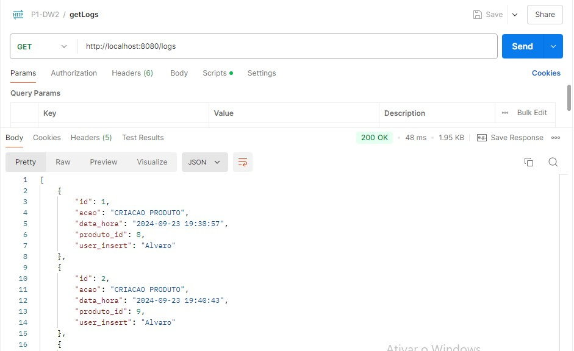
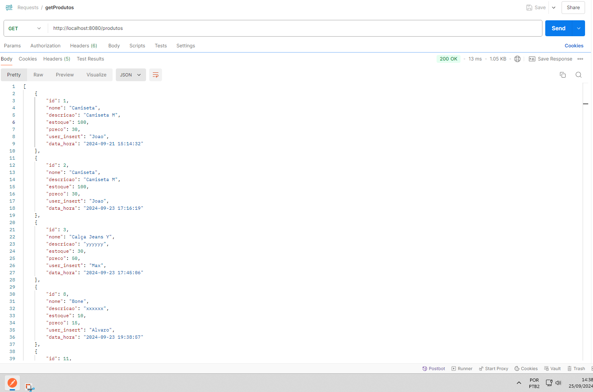
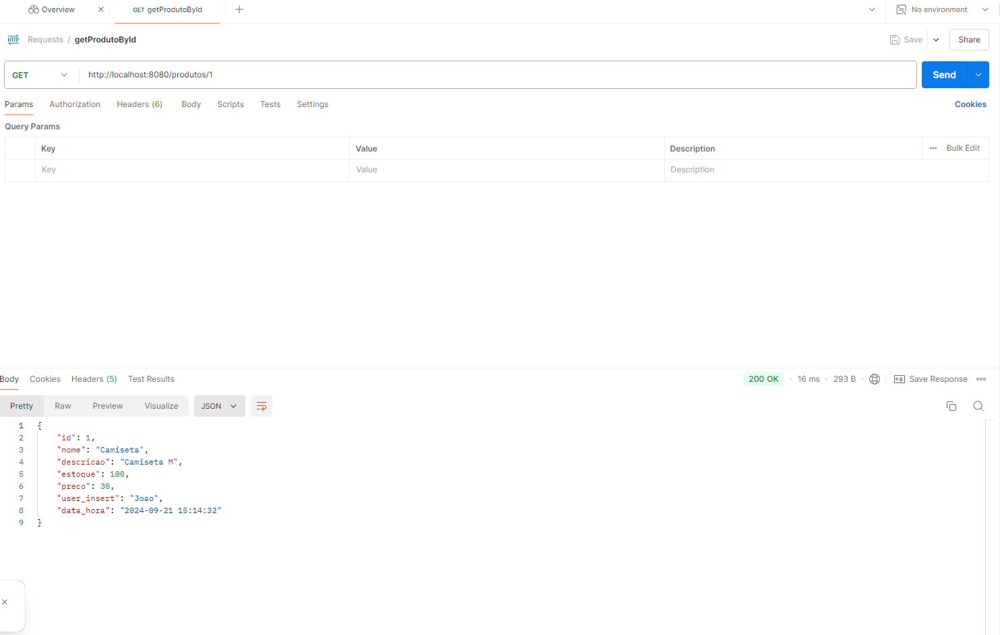
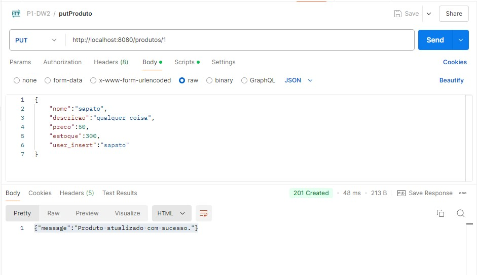
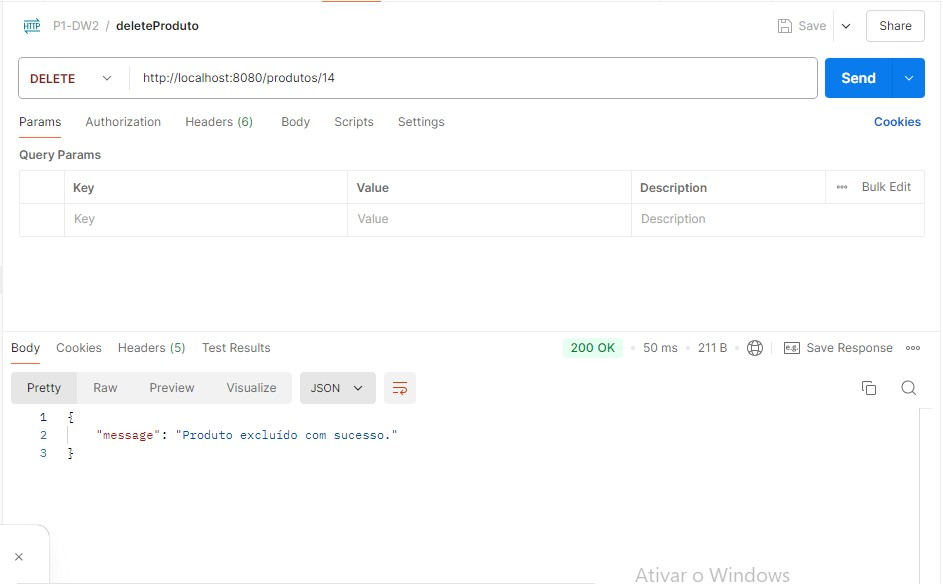

# CRUD REST 
Aplicação backend CRUD (Create, Read, Update & Delete) simples desenvolvida com PHP e SQLite <br>

Alvaro Barbosa Sena <br>
Rafael Mascarenhas Borges

## 🚀 Funcionalidadeas

- Listagem de produtos
- Listagem de um produto específico
- Criação de produto
- Atualização de produto
- Exclusão de produto
- Listagem de logs

## Relatório Técnico

### Desenvolvimento, dificuldades e soluções de problemas

A aplicação foi desenvolvida utilizando a arquitetura MVC (Model, View & Controller), sendo o Model a camada mais íntima da aplicação e os "controllers", a camada mais acessível. 
Para a persistência de manutenibilidade dos dados, foi implementado o banco de dados SQLite. Ao implementá-lo, surgiram várias dificuldades: a primeira foi habilitar o driver e depois fazê-lo conectar com o banco no momento em que classe era instanciada. Resolvemos o problema criando a conexão no próprio construtor <i>__construct</i> da classe.

Ademais, também foi implementado validações na camada do "controller" do produto, para garantir que os dados fossem válidos, como a verificação do nome do produto, do estoque e preço.

O logs foram implementados no momento das queries no model de produto. No momento que o produto é cadastrado, atualizado ou excluído, um log é criado no sistema. Porém, encontramos dificuldades para fazê-lo, sobretudo quando um produto é excluído, pois o <i>user_insert</i> é um atributo da tabela de Log. Portanto, fizemos uma segunda query, antes da exclusão do produto, para pegar o atributo e, só assim, finalizar a operação. 


### Endpoints

<strong>GET /logs</strong>


<strong>GET /produtos</strong>


<strong>GET /produtos/{id}</strong>


<strong>POST /produtos</strong>


<strong>PUT /produtos/{id}</strong>


<strong>DELETE /produtos/{id}</strong>


## 👨‍💻 Começando

```
$ git clone https://github.com/RafaelBorges22/crud-restAPI.git
````

```
$ cd crud-restAPI/
````

```
$ cd app/
````

```
$ php -S localhost:8080
````